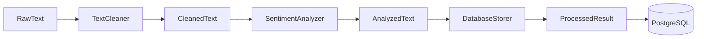

# Data Processing Pipeline

> Part of the [Python Labs Monorepo](https://github.com/franakol/python-labs-monorepo)

A multi-stage data processing pipeline built with SOLID principles, comprehensive testing (unit + integration with testcontainers), and structured logging.

## 🎯 Lab Objectives

- **SOLID Principles**: Single Responsibility, Dependency Injection
- **Testing Pyramid**: Unit tests (53) + Integration tests (6) with testcontainers
- **Clean Architecture**: Separate interfaces and implementations
- **Observability**: Structured logging with trace IDs

## ⚡ Quick Start

```bash
cd data-processing-pipeline
python -m venv venv
source venv/bin/activate
pip install -e ".[dev]"
pre-commit install
```

## 📁 Architecture

```
pipeline/
├── models.py                 # Data models (RawText, CleanedText, etc.)
├── exceptions.py             # Custom exceptions (CleaningError, etc.)
├── pipeline.py               # DataPipeline orchestrator
├── logging_config.py         # Structured logging setup
├── interfaces/
│   └── stages.py             # PipelineStage ABC, stage interfaces
└── implementations/
    ├── text_cleaner.py       # TextCleaner - whitespace, HTML, unicode
    ├── sentiment_analyzer.py # SentimentAnalyzer - keyword-based
    └── database_storer.py    # DatabaseStorer - PostgreSQL storage
```



## 🔧 Usage

```python
from pipeline.pipeline import DataPipeline
from pipeline.implementations.text_cleaner import TextCleaner
from pipeline.implementations.sentiment_analyzer import SentimentAnalyzer
from pipeline.implementations.database_storer import DatabaseStorer
from pipeline.models import RawText

# Create pipeline with dependency injection
stages = [
    TextCleaner(),
    SentimentAnalyzer(),
    DatabaseStorer(connection=db_connection),
]
pipeline = DataPipeline(stages)

# Process text
raw = RawText(content="<p>This product is amazing!</p>", source="review")
result = pipeline.run(raw)

print(f"Sentiment: {result.sentiment.value}")
print(f"Score: {result.sentiment_score}")
```

## 🧪 Testing

### Unit Tests
```bash
pytest tests/unit -v
pytest tests/unit --cov=pipeline --cov-report=term-missing
```

### Integration Tests (requires Docker)
```bash
pytest tests/integration -v -m integration
```

### Full Test Suite
```bash
pytest -v
```

## 📊 Test Coverage

| Component | Coverage |
|-----------|----------|
| exceptions.py | 100% |
| models.py | 100% |
| text_cleaner.py | 100% |
| sentiment_analyzer.py | 96% |
| database_storer.py | 92% |
| pipeline.py | 94% |
| **Total** | **90%+** |

## 🔍 Pipeline Stages

### 1. TextCleaner
- Removes leading/trailing whitespace
- Normalizes internal whitespace (tabs, newlines → spaces)
- Strips HTML tags
- Normalizes unicode (NFKC)
- Removes zero-width characters

### 2. SentimentAnalyzer
- Keyword-based sentiment detection
- Positive/negative word lists
- Score range: -1.0 to 1.0
- Classifications: POSITIVE, NEUTRAL, NEGATIVE

### 3. DatabaseStorer
- PostgreSQL storage via psycopg2
- Transaction handling (commit/rollback)
- Returns ProcessedResult with database ID

## 📝 License

MIT License
